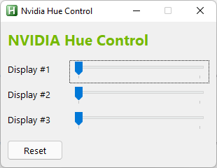

# AutoHotkey wrapper for NVIDIA NvAPI

## Features
* retrieves a string describing the version of the NvAPI library
* retrieves information related to the NVIDIA Display Driver
* retrieves the Digital Vibrance Control (DVC) information
* retrieves the HUE information
* retrieves the Quadro status for the GPU (1 if Quadro, 0 if GeForce)
* retrieves the RAM maker associated with this GPU
* retrieves the available driver memory footprint
* retrieves the cooler information
* retrieves the current Level (Normal, Medium or Critical) of the thermal sensor
* retrieves the current fan speed Level (Normal, Medium or Critical)
* retrieves the display driver memory information
* retrieves the display driver version and driver-branch
* retrieves the full GPU name
* retrieves the information about the system's chipset
* retrieves the total number of cores defined for a GPU
* retrieves the type of VRAM associated with this GPU
* retrieves the usage associated with this GPU
* sets the DVC level for the selected display
* sets the HUE level for the selected display

## Examples
### All functions and returns in a ListView

### Classic GUI (Clocks, Load, Fans & Temperature)

### Set Digital Vibrance (DVC) per Display

### Nvidia Hue Control

## Contributing
* special thanks to 'just me', 'nnnik' and 'RUNIE'
* thanks to AutoHotkey Community

## Questions / Bugs / Issues
If you notice any kind of bugs or issues, report them on the [AHK Thread](https://www.autohotkey.com/boards/viewtopic.php?t=94333). Same for any kind of questions.

## Copyright and License
[MIT License](LICENSE) & NVIDIA NVAPI SDK LICENSE

## Donations
[Donations are appreciated if I could help you](https://www.paypal.me/smithz)