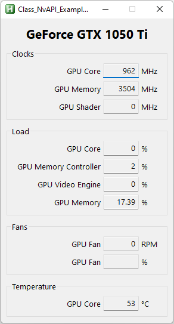

# AutoHotkey & NVIDIA (NvAPI) by jNizM

## Converted NvAPI-Functions
* DisableHWCursor()
* DISP_GetGDIPrimaryDisplayId()
* DRS_CreateSession()
* DRS_DestroySession()
* DRS_GetCurrentGlobalProfile()
* DRS_GetNumProfiles()
* DRS_LoadSettings()
* DRS_LoadSettingsFromFile()
* DRS_RestoreAllDefaults()
* DRS_SaveSettings()
* DRS_SaveSettingsToFile()
* EnableHWCursor()
* EnumLogicalGPUs()
* EnumNvidiaDisplayHandle()
* EnumNvidiaUnAttachedDisplayHandle()
* EnumPhysicalGPUs()
* GetAssociatedDisplayOutputId()
* GetAssociatedNvidiaDisplayHandle()
* GetAssociatedNvidiaDisplayName()
* GetDisplayDriverMemoryInfo()
* GetDisplayDriverVersion()
* GetDisplayPortInfo()
* GetDVCInfo()
* GetDVCInfoEx()
* GetErrorMessage()
* GetHDMISupportInfo()
* GetHUEInfo()
* GetInterfaceVersionString()
* GetUnAttachedAssociatedDisplayName()
* GetVBlankCounter()
* GPU_GetAGPAperture()
* GPU_GetAllClockFrequencies()
* GPU_GetBoardInfo()
* GPU_GetBusId()
* GPU_GetBusSlotId()
* GPU_GetBusType()
* GPU_GetCoolerSettings()
* GPU_GetCurrentAGPRate()
* GPU_GetCurrentPCIEDownstreamWidth()
* GPU_GetCurrentPstate()
* GPU_GetDynamicPstatesInfoEx()
* GPU_GetFullName()
* GPU_GetGpuCoreCount()
* GPU_GetGPUType()
* GPU_GetHDCPSupportStatus()
* GPU_GetIRQ()
* GPU_GetMemoryInfo()
* GPU_GetOutputType()
* GPU_GetPerfDecreaseInfo()
* GPU_GetPhysicalFrameBufferSize()
* GPU_GetSystemType()
* GPU_GetTachReading()
* GPU_GetThermalSettings()
* GPU_GetUsages()
* GPU_GetVbiosOEMRevision()
* GPU_GetVbiosRevision()
* GPU_GetVbiosVersionString()
* GPU_GetVirtualFrameBufferSize()
* GPU_SetCoolerLevels()
* SetDVCLevel()
* SetDVCLevelEx()
* SetHUEAngle()
* Stereo_IsEnabled()
* Stereo_IsWindowedModeSupported()
* SYS_GetChipSetInfo()
* SYS_GetDriverAndBranchVersion()
* Unload()
* VIO_EnumDevices()
* VIO_GetCapabilities()
* VIO_IsRunning()
* VIO_Start()
* VIO_Stop()

## Examples:
### All functions and returns in a ListView

### Classic GUI (Clocks, Load, Fans & Temperature)

### Set Digital Vibrance (DVC) per Display

## Info
* URL: [AHK Thread](http://ahkscript.org/boards/viewtopic.php?f=6&t=5508)

## Contributing
* special thanks to AHK Member "just me"
* thanks to AutoHotkey Community

## Copyright and License
[Unlicense](LICENSE) & NVIDIA NVAPI SDK LICENSE